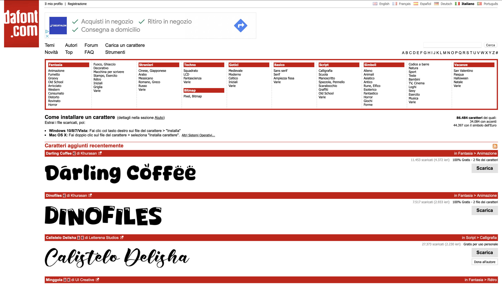
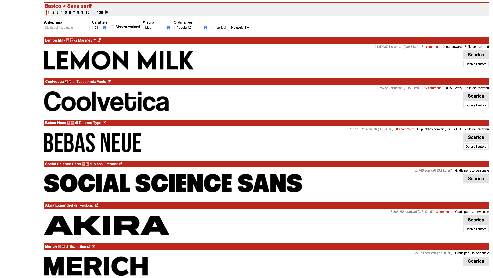

SUPSI 2022-23  
Corso d’interaction design, CV427.01  
Docenti: A. Gysin, G. Profeta  

Elaborato 1: XS

# TYP1A
Autore: Gizzi Andrea  
[Typia](https://andrea-gizzi.github.io/TYP1A/)

## Introduzione e tema
La consegna consisteva nella realizzazione di un sistema di interfaccia web interattiva che consentisse di esplorare 100 elementi legati da un tema comune, scelti e autoprodotti. 

Nel mio caso è stato realizzato un archivio interattivo contenente i 100 font più utilizzati al mondo. L'obiettivo principale dell'interfaccia è facilitare la scelta del font più adatto e approfondirne le informazioni. L'utente ha la possibilità di esplorare i diversi font, inserire una lettera specifica per confrontare le variazioni tra i font, visualizzare i metadati e selezionare le categorie di interesse.


## Riferimenti progettuali
Nel progetto, non sono stati utilizzati riferimenti progettuali precisi, l'interfaccia è stata costruita in base alle esigenzze del progetto al fine di avere un'approccio visivo che valorizzasse ogni singolo contenuto in base alla ricerca in corso, rendendolo funzionale e facilmente leggibile. L'unico riferimento sfruttato è stato quello dell'archivio digitale di daFont, interfaccia che permette di visualizzare in amplia scala molteplici font suddivisi in molteplici categorie.

[]()
[]()


## Design dell’interfraccia e modalià di interazione
L'intero archivio digitale è stato realizzato in modo tale da avere una buona ergonomia atraverso semplicità, leggibilità e coerenza. Ogni pagina del sito web presenta una struttura uniforme: un header nella parte superiore, composto dal logo e da bottoni intuitivi per la navigazione e la selezione dei filtri, un footer nella parte inferiore e i contenuti al centro della pagina. Per mantenere la semplicità non è stato uso del colore, infatti lo sfondo è sempre color antracite contraposto dal bianco dei comandi e delle immagini e dettagli neri tra cui il font presente nell'immagine.

L'intera interfaccia è composta da varie modalità di interazione tra cui: differenti bottoni che fungono da filtri o da navigazione tra le varie pagine. Inoltre, è possibile visualizzare i metadati di ciascun font tramite un semplice overlay sull'immagine, che mostra i vari dati su fondo nero sostituendo l'immagine. L'unica pagina all'interno del sito che presenta una struttura differente è quella dedicata alla visione dei metadati. È stata progettata per coloro che preferiscono accedere alle informazioni in modo diretto, senza navigare attraverso le immagini.

[]()


## Tecnologia usata
L'intero sito è strutturato sulla rappresentazione dei metadati in varie categorie permettendo all'utente di decidere quale categoria vuole vedere tramite i bottoni che fungono da filtro. La struttura delle categorie nella home è stata scelta per facilitare il confronto tra i font permettendo all'utente maggiore comprensione delle minime differenze, permettendo cosi la funzione corretta dei filtri.


```JavaScript
const image = new Image();
image.onload = () => {
	gl.bindTexture(gl.TEXTURE_2D, texture);
	gl.texImage2D(
		gl.TEXTURE_2D,
		level,
		internalFormat,
		srcFormat,
		srcType,
		image
	);
	if (isPowerOf2(image.width) && isPowerOf2(image.height)) {
		gl.generateMipmap(gl.TEXTURE_2D);
	} else {
		gl.texParameteri(gl.TEXTURE_2D, gl.TEXTURE_WRAP_S, gl.CLAMP_TO_EDGE);
		gl.texParameteri(gl.TEXTURE_2D, gl.TEXTURE_WRAP_T, gl.CLAMP_TO_EDGE);
		gl.texParameteri(gl.TEXTURE_2D, gl.TEXTURE_MIN_FILTER, gl.LINEAR);
	}
};
image.src = url;
```

## Target e contesto d’uso
L'artefatto digitale è concepito per un pubblico giovane e dinamico, principalmente attivo nel campo della grafica. Si rivolge a coloro che devono selezionare un carattere tipografico adatto a specifici contesti di utilizzo, o che sono interessati a informarsi ed esplorare il vasto archivio dei metadati di ogni font. Il contesto d'utilizzo dell'archivio è diversificato e variegato. Può essere sfruttato a fini educativi e accademici, per uso personale o in ambito professionale, come ad esempio in studi di design grafico o per progetti indipendenti.

[]()
